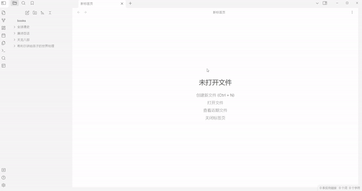

# Epub Importer

Import .epub file into your vault as markdown notes.

## Usage

Run `Epub Importer: Import epub to your vault` command, 
and input the absolute path to .epub file you want to import it into your obsidian vault.

Then, the .epub file will be converted to a folder and some notes, 
so you can read the book directly in obsidian, and make some marks, make some links and notes.



Or, you can add some `libraries`` in settings, and epubs under the paths will come out when you type the command.

### Propertys template

all available variables:

```
- {{bookName}}
- {{title}}
- {{author}}
- {{publisher}}
- {{language}}
```

example:

```
title: {{bookName}}
author: {{author}}
publisher: {{publisher}}
status: false
```

### AssetsPath template

all available variables:

```
- {{savePath}}
- {{bookName}}
```

example:

```
{{savePath}}/{{bookName}}/images
```

# Platform

The function is tested based on Windows system. I don’t have an Apple computer.

# How to issue bugs

You should upload the epub the same time. 

You should also upload the .epub file where the bug occurred. Github does not support uploading files in .epub format. It doesn't matter. You just need to change its suffix to .zip and upload it.

>[!warning]
>Please do not compress it in a zip file and upload the zip file.